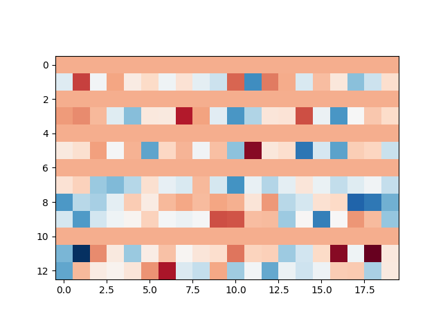
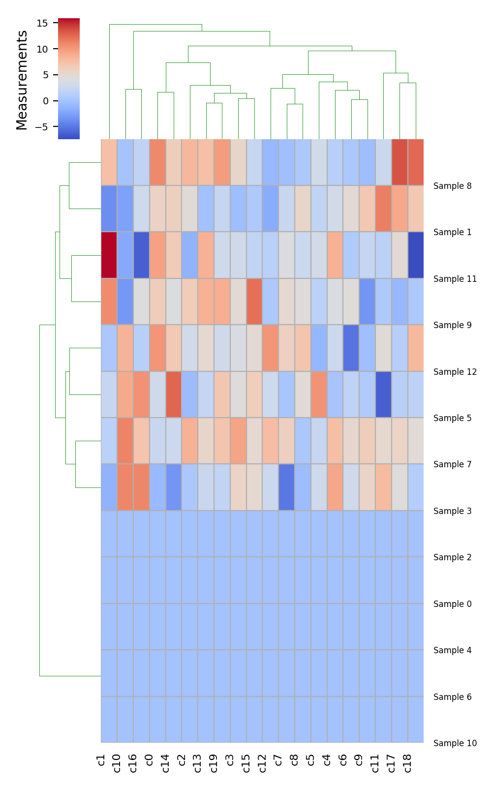

# HeatMap 热图 

### python实现heatMap,并进行层次化聚类

使用方法：自行导入数据，代码中为testL。

图像映射颜色：修改imshow中的cmap参数。可以在这里选择映射图像的参数：
[http://matplotlib.org/examples/color/colormaps_reference.html](http://matplotlib.org/examples/color/colormaps_reference.html)

### 样例

### 参考

参考链接：[http://nbviewer.jupyter.org/github/ucsd-scientific-python/user-group/blob/master/presentations/20131016/hierarchical_clustering_heatmaps_gridspec.ipynb](http://nbviewer.jupyter.org/github/ucsd-scientific-python/user-group/blob/master/presentations/20131016/hierarchical_clustering_heatmaps_gridspec.ipynb)

